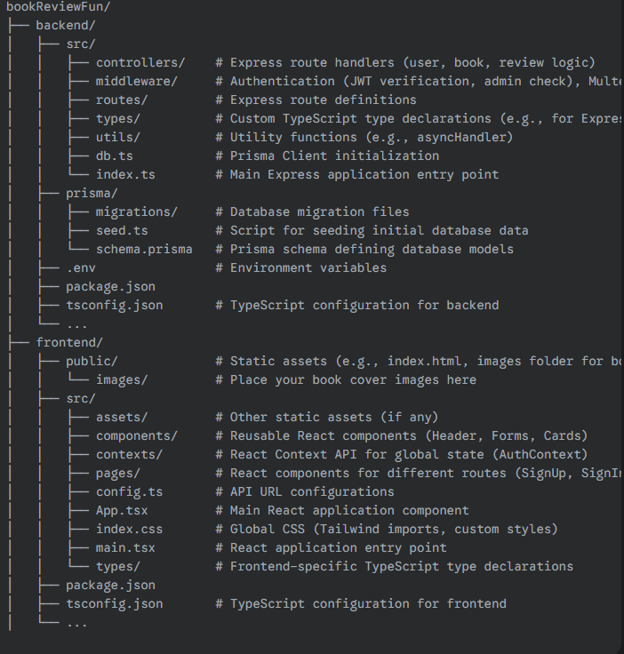

# 📚 BookReviewFun - MERN Stack Book Review Platform

## A comprehensive web application for managing books, reviews, and user interactions.

---

## Table of Contents

1.  [Introduction](#1-introduction)
2.  [Features](#2-features)
3.  [Technologies Used](#3-technologies-used)
4.  [Getting Started](#4-getting-started)
    - [Prerequisites](#prerequisites)
    - [Cloning the Repository](#cloning-the-repository)
    - [Environment Variables](#environment-variables)
5.  [Database Setup (PostgreSQL & Prisma)](#5-database-setup-postgresql--prisma)
    - [Schema Overview](#schema-overview)
    - [Running Migrations](#running-migrations)
    - [Seeding Initial Data](#seeding-initial-data)
6.  [Backend Setup & Run](#6-backend-setup--run)
    - [Installation](#installation)
    - [Running the Server](#running-the-server)
    - [API Endpoints](#api-endpoints)
7.  [Frontend Setup & Run](#7-frontend-setup--run)
    - [Installation](#installation-1)
    - [Running the Client](#running-the-client)
8.  [Project Structure](#8-project-structure)
9.  [Future Enhancements](#9-future-enhancements)
10. [Contact](#10-contact)

---

## 1. Introduction

BookReviewFun is a full-stack web application built using the MERN (MongoDB, Express.js, React.js, Node.js) stack, with PostgreSQL as the relational database and Prisma as the ORM. This platform allows users to explore a collection of books, register, sign in, add new books (admin-only), write reviews, and manage their personal read lists. It emphasizes robust authentication, efficient data management, and a user-friendly interface.

This project demonstrates proficiency in developing scalable and maintainable web applications, adhering to modern development practices.

## 2. Features

The application provides the following core functionalities:

- **User Authentication:**
  - Secure user registration with password hashing (bcryptjs).
  - User sign-in and sign-out functionality using JWT (JSON Web Tokens) for secure session management.
  - Protected routes ensuring only authenticated users can access certain features.
  - Role-based access control (Admin/User) to manage book creation.
- **Book Management:**
  - View a comprehensive list of all available books with pagination for efficient Browse.
  - Detailed view for each book, including its description, author, release year, and cover image.
  - **Admin-only:** Functionality to add new books to the platform, including uploading cover images.
- **Review System:**
  - Users can submit reviews (ratings and comments) for any book.
  - View all reviews associated with a specific book.
- **Read List:**
  - Users can add books to and remove books from their personal read list.
- **Pagination:**
  - Efficiently retrieves and displays large datasets of books, improving performance and user experience.
- **Responsive Design:**
  - Built with Tailwind CSS for a modern, responsive, and visually appealing user interface across various devices.
- **User Feedback:**
  - Integrated `react-toastify` for clear and timely user notifications (success, error messages).

## 3. Technologies Used

This project leverages a powerful combination of technologies:

**Backend:**

- **Node.js:** JavaScript runtime environment.
- **Express.js:** Fast, unopinionated, minimalist web framework for Node.js.
- **PostgreSQL:** Robust, open-source relational database system.
- **Prisma ORM:** Next-generation ORM for Node.js and TypeScript, providing type-safe database access and powerful migrations.
- **JWT (jsonwebtoken):** For creating and verifying authentication tokens.
- **bcryptjs:** For secure password hashing.
- **Multer:** Node.js middleware for handling `multipart/form-data`, primarily used for file uploads (book cover images).
- **dotenv:** For managing environment variables securely.
- **express-async-handler:** Utility for simplifying error handling in asynchronous Express middleware.

**Frontend:**

- **React.js:** A declarative, component-based JavaScript library for building user interfaces.
- **React Router DOM:** For declarative routing in React applications.
- **Axios:** Promise-based HTTP client for making API requests.
- **React Toastify:** For elegant and customizable toast notifications.
- **Tailwind CSS:** A utility-first CSS framework for rapidly building custom designs.

---

### ⭐ **Highlight: Strategic Use of TypeScript**

While the MERN stack typically implies JavaScript, this project was developed using **TypeScript** for both the backend (Node.js/Express/Prisma) and the frontend (React). This decision was made proactively to enhance the development process and the robustness of the application by:

- **Improved Code Quality:** Catching type-related errors at compile-time rather than runtime, leading to fewer bugs in production.
- **Enhanced Maintainability:** Providing clear type definitions makes the codebase easier to understand, refactor, and extend, especially in larger teams or for future development.
- **Better Developer Experience:** Leveraging IDE features like auto-completion, intelligent refactoring, and inline documentation for a more efficient and less error-prone coding experience.
- **Scalability:** TypeScript's strong typing is invaluable for complex applications, ensuring data consistency across different layers (frontend, backend, database schema via Prisma).

This choice demonstrates an understanding of modern software engineering principles and a commitment to building high-quality, maintainable applications.

---

## 4. Getting Started

Follow these steps to get the BookReviewFun project up and running on your local machine.

### Prerequisites

- Node.js (v18 or higher recommended)
- npm (v8 or higher recommended)
- PostgreSQL database server (running locally or accessible via a cloud provider like Neon.tech)
- Git

### Cloning the Repository and run the project

```bash
git clone <your-repo-url>
cd bookReviewFun # Or whatever your project's root folder is named


cd frontend
npm i
npm run dev


# open second terminal
cd backend
npm i
npm run dev

# remember to add .env file in both frontend and backend
```

## postman api route collection

[All the Routes](https://galactic-astronaut-566580.postman.co/workspace/backend~caffbc7f-5477-4442-8c6d-fb46d774e4c9/collection/16063518-5582a807-0224-4d72-9327-3c7d0e6dc1ea?action=share&creator=16063518)

### directory structure


